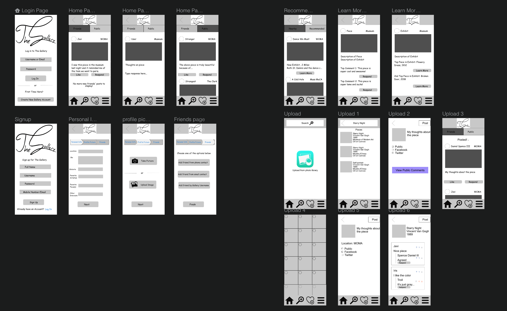
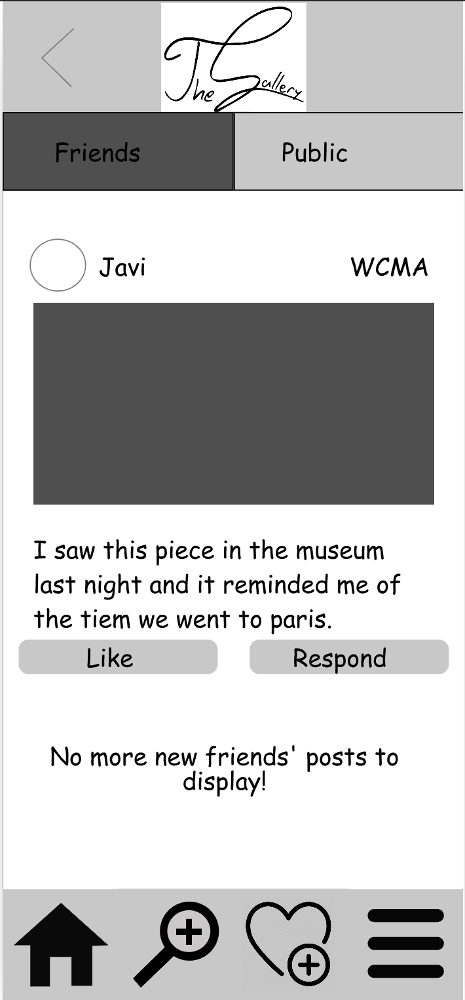
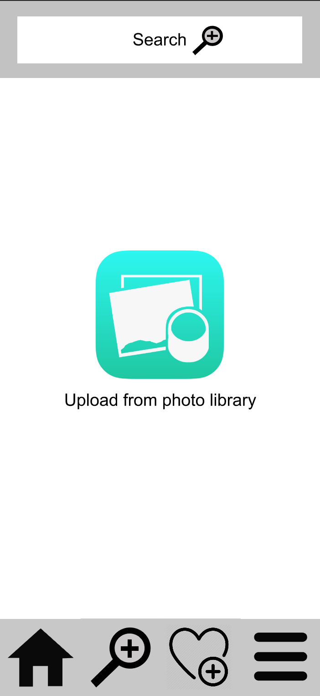
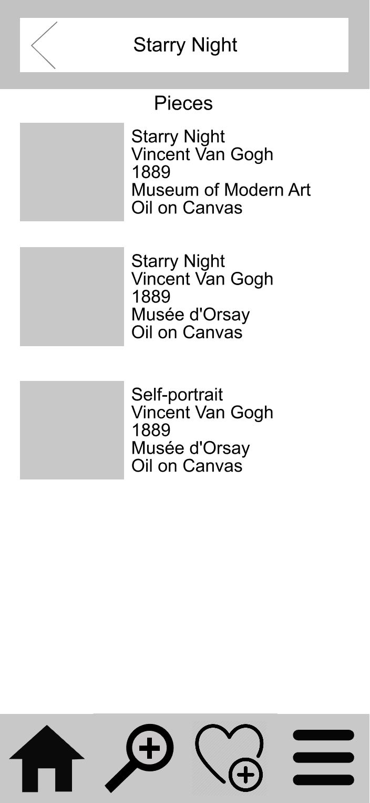
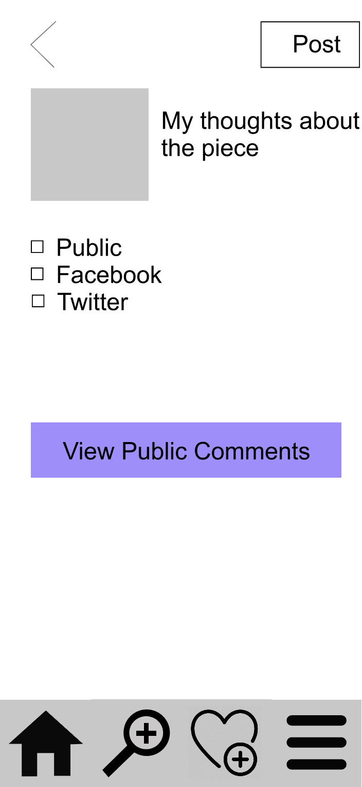
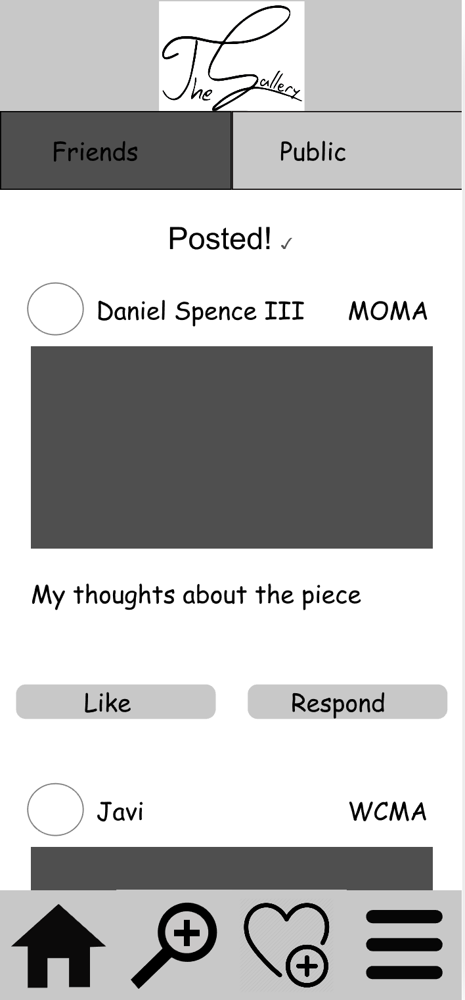

# High Fidelity Prototype Overview

# Task 1: Make a post to that can be seen by your friends

Having either followed the signup screen to set up an account for The Gallery or signed in using their credentials, users see a running list of posts from their friends as they first enter the app. 

In the bottom navigation pane, there is a button that functions as both dual search and upload function. Users can press this button to go ahead and either select images from their personal gallery or search digitized museum collection libraries. 

For instance, if the user was to choose to post starry night, as we had the participants in our usability tests perform. They would go ahead and start inserting this term into the search bar. This would result in a popdown menu with autocompleted piece suggestions that the user can easily select. 

Once selected, the user is redirected to the post page to add their thoughts and make a final post. 

The user is then redirected back to the home page with a confirmation at the top of their screen that their post has been successfully completed. 

# Task 2: search for nearby recommendation

[Link to digital mockup](https://projects.invisionapp.com/prototype/cjof1i4ah00ojzz0134v6h7sg/play)
