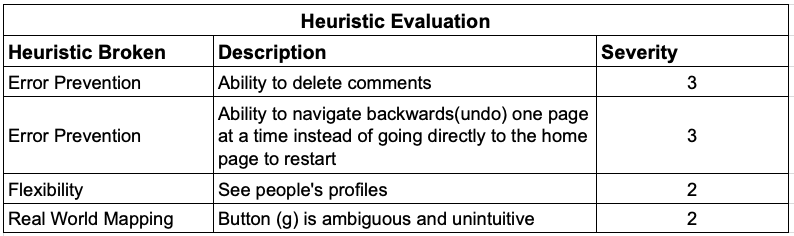
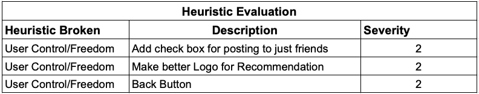
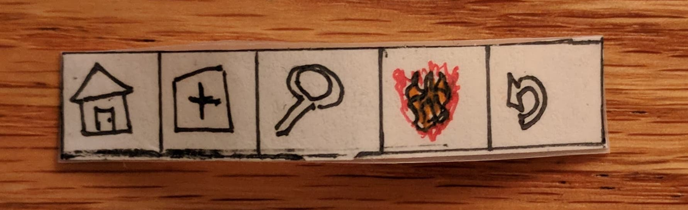
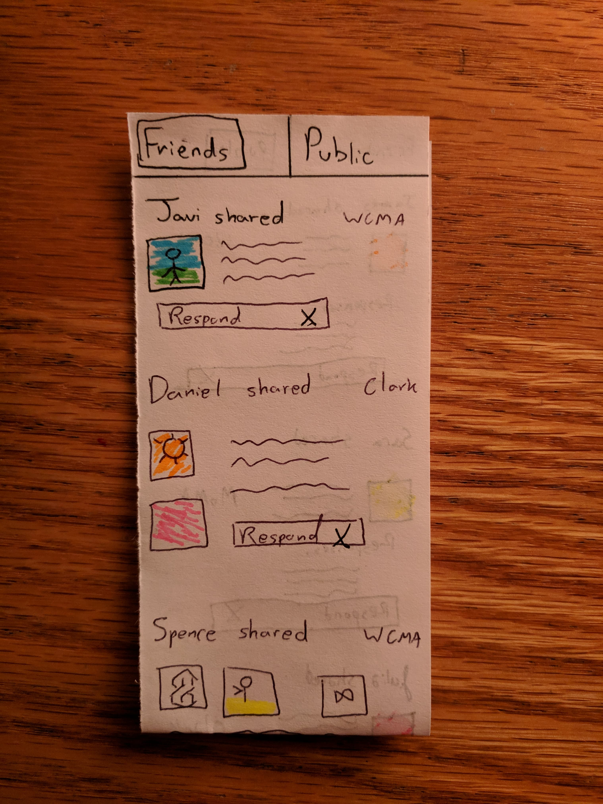
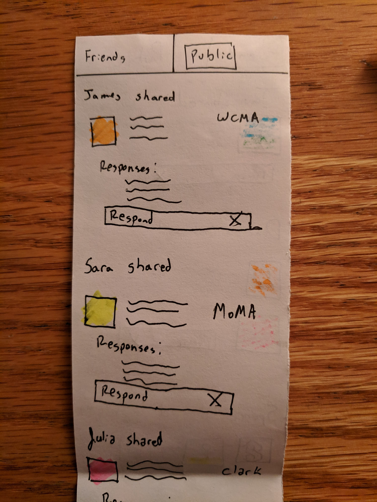
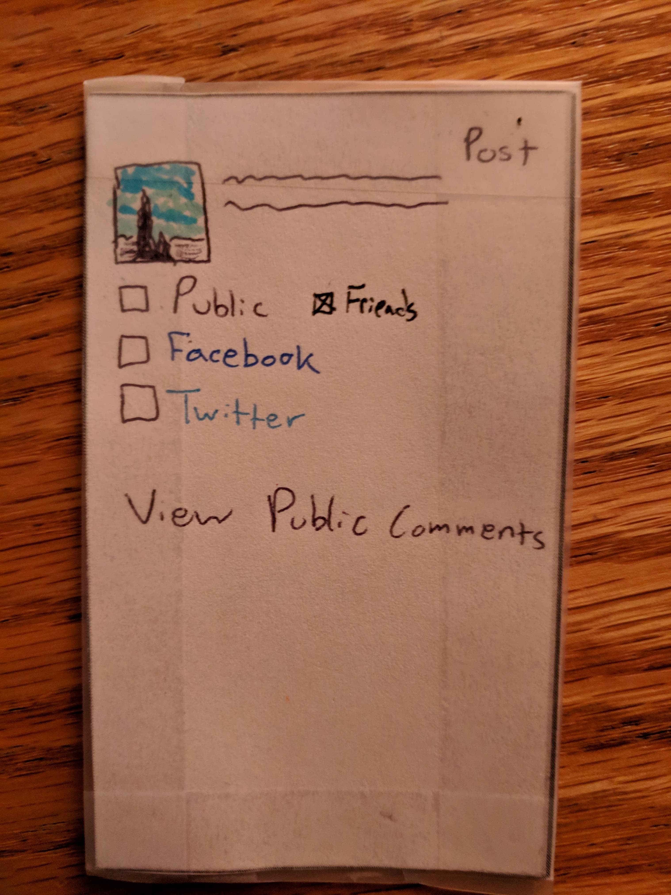

# First Heuristic Evaluation

Javi + Julia + Linda

# Second Heuristic Evaluation

Spence + Daniel + Steve

# Paper Prototype Revisions
Having the ability to navigate to a previous screen was feature we were missing in our design. We fixed this by adding a back button in the footer of the app so that users can have more freedom in their use of The Gallery. Additionally, many agreed that the logo for recommendation was ambiguous. Therefore, we changed it to a fire to see what is "hot" pieces are around you or could be of interest to the user. On top of this, we gave the users the flexibility to delete comments and posts they share. We also added clearer option to share with friends or publicly by adding a switch between the two.

(description of revisions here)
