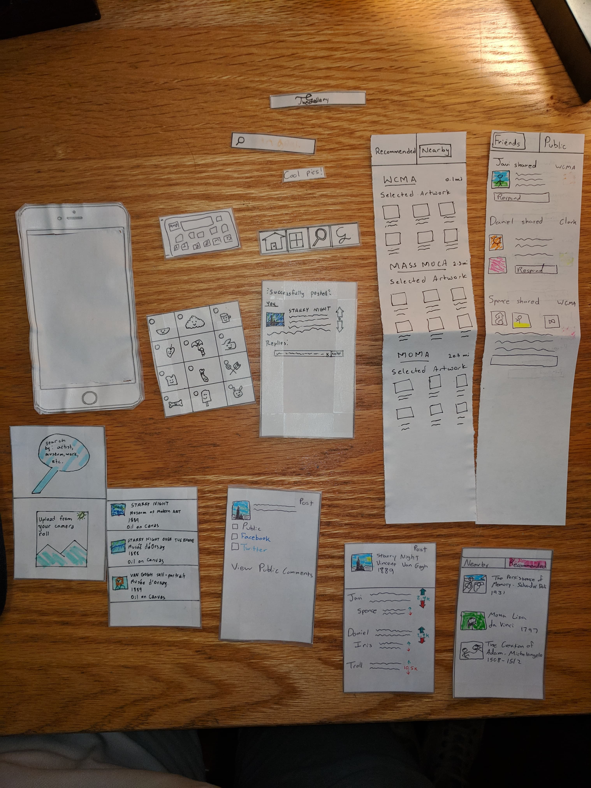
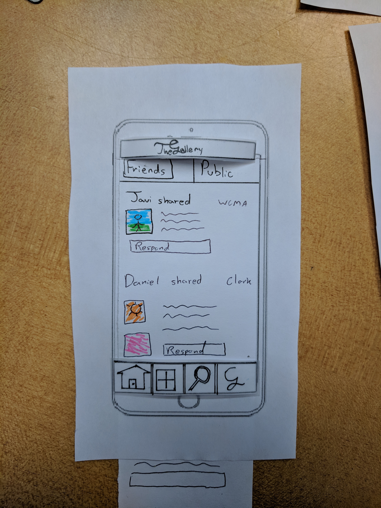

# Overview
This is an overview of the parts of our paper prototype. These pieces are meant to simulate a phone app.

# Task 1: Take discussion outside of the museum

Looking at the home screen, users can decide whether to look at their friend's post or include stangers'.

Users are able to scroll down and click the "plus" button to share their picture.

Users can choose to use the museums' pictures or their own.

### User selects to use the museums' images:

User decides to look for pictures submitted by museums.

User searches for Van Gogh to see his different pieces.

User selects Starry night.

Here, they can write what they think about the piece as well as change their sharing settings.

User is done, they decide to share it only within The Gallery and with friends only.

User is taken to their created post

### User selects to upload from their phone:

User taps to use his own photo library

Selected picture is highlighted

## User decides lo look at current discussion:

User taps on the magnifying glass to look for pieces without wanting to share them.

User finds an interesting art piece.

People's comments on the piece show up, ranked from highest rated to lowest.

# Task 2: Get recommendations

User selects The Gallery's recommendation icon

User is taken to the recommendation screen and chooses recommended Artworks to see pieces they might enjoy

User then selects the nearby toogle in the recommendation screen

User scrolls down to find the nearby museums with interesting Artworks on display

