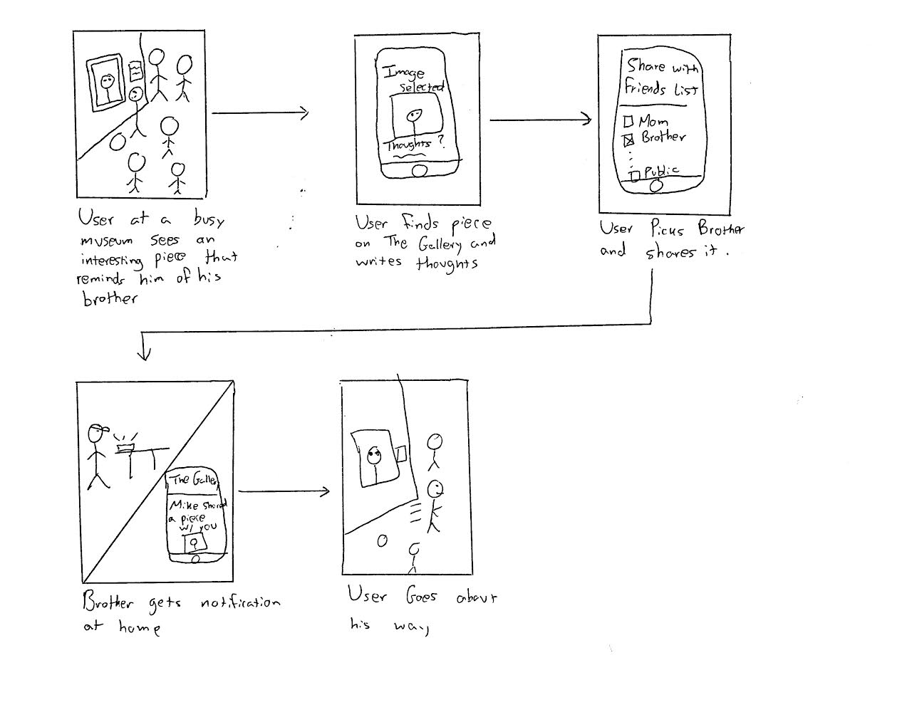
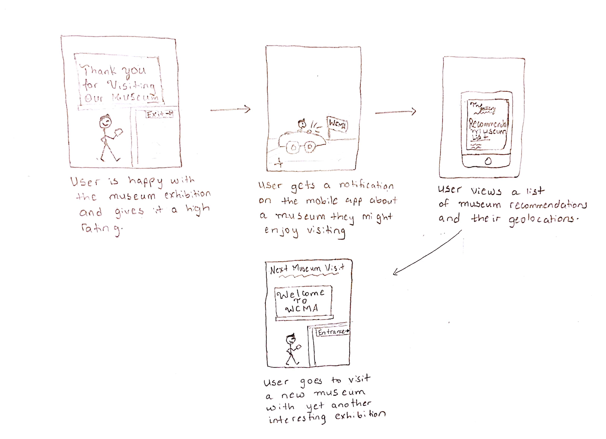

We ultimately selected to use our mobile design.  The tasks which we’re choosing to focus on are:

1. Bring discussion of art outside of the museum

2. Recommend new art/exhibits/museums to see based on preferences

We ended up choosing these for a couple of a key reasons.  For the first task, we see that in aiming to bring discussions outside of the museum, we also necessarily encompass some other features we wanted to include, namely the ability to share high quality photos with commentary, engaging in discussions with friends and family, and making dialogue around art more accessible.  We also see that using our mobile, app-based design works excellently for this as people tend to have their mobile devices on them wherever they are, and can always check notifications about their ongoing posts, conversations, etc.  Our other two designs would be less conducive to this: a desktop website is less accessible for engaging in discussion, while a smart-watch app can show notifications, but doesn’t really allow for users to respond to discussions, as there’s no keyboard feature.  As for the recommendation feature, we decided to pick this task as it is fairly different from our first task, is of interest to us and those we conducted contextual inquiries on, and works excellently with mobile device’s location services for our implementation.  It would be interesting to get recommendations in your area (especially when you’re visiting new cities) based on what types of art, exhibits and museums you have enjoyed in the past.  We see, again, that mobile would work far better than desktop in terms of location services.  We note, however, that a smart-watch implementation could possibly accomplish this task as well, although there would also be less screen-space to display and explore all of the recommendations in larger metropolitan areas.  We also realised that our final proposed task, of meeting new people with similar interests, didn’t really fit well into the rest of our design, and see that people from our contextual inquiries were also less compelled by that task than by those which we’re focusing in on.

