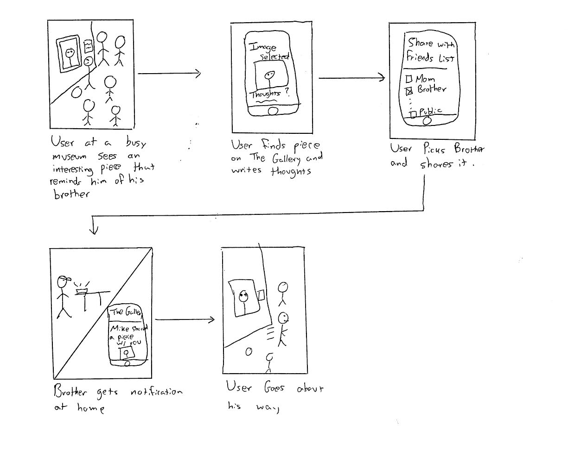

# Design choice

We ultimately decided to use our mobile design for the two specific tasks that we chose to focus on, i.e bringing discussions of art outside of the museum and recommending new art based on prior preferences. We chose to focus on these 2 tasks for our design for a couple of reasons. For the first task, we see that in aiming to bring discussions outside of the museum, we also necessarily encompass some other features we wanted to include, namely the ability to share high quality photos with commentary, engaging in discussions with friends and family, and making dialogue around art more accessible. We also see that using our mobile, app-based design works excellently for this as people tend to have their mobile devices on them wherever they are, and can always check notifications about their ongoing posts, conversations, etc. Our other two designs would be less conducive to this: a desktop website is less accessible for engaging in discussion, while a smart-watch app can show notifications, but doesn’t really allow for users to respond to discussions, as there’s no keyboard feature. As for the recommendation feature, we decided to pick this task as it is of interest to us and those we conducted contextual inquiries on, and works excellently with mobile device’s location services for our implementation. It would be interesting to get recommendations in your area (especially when you’re visiting new cities) based on what types of art, exhibits and museums you have enjoyed in the past.

# Written Scenarios and Storyboards

## Art Discussion Storyboard

## Written Scenario

Josh is a college student who likes to visit museums whenever he gets a bit of free time to himself. He usually just browses the different artworks and admires the effort that is put into creating them as he is a studio art major. However, every now and then, one of the artworks catches his eye or reminds him of someone he knows. One such day, he saw a painting from the 1800s that he thought would resonate with his brother. He pulls out his phone, opens The Gallery app, and does a keyword search to find a digital HQ archived version of this interesting piece of art. After this, he simply inserts his thoughts about the artwork and shares it with his brother. A few minutes later, he gets a notification back from his brother’s response to the artwork and they continue their conversation via the thread created for their image. 

## Museum/Art Recommendation Storyboard

## Written Scenario

Bob loves to travel and usually finds himself in the strangest of places in his journeys. He has always enjoyed visiting museums but has a hard time actually finding places that fit his particular taste in Art. In fact, he is usually frustrated when the hears about interesting art exhibitions that were happening around him only after they have come to pass. However, thankfully, he had downloaded The Gallery before he started his journey to little old Williamstown. As he was driving past WCMA, he received a notification that recommended WCMA having crosschecked his preferences with the current exhibitions at the museum. When bob got a little bit of free time to visit museums, he opened up The Gallery and simply clicked on the geotagged recommended museum and followed the route to his destination. 
