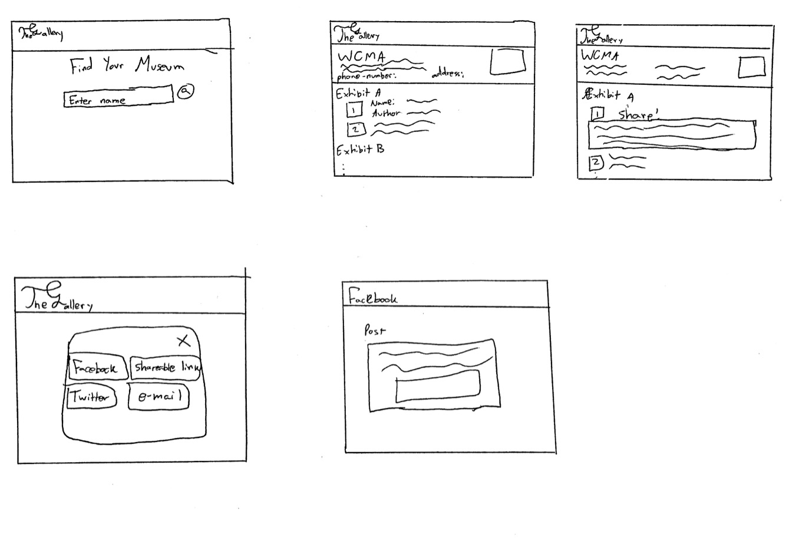
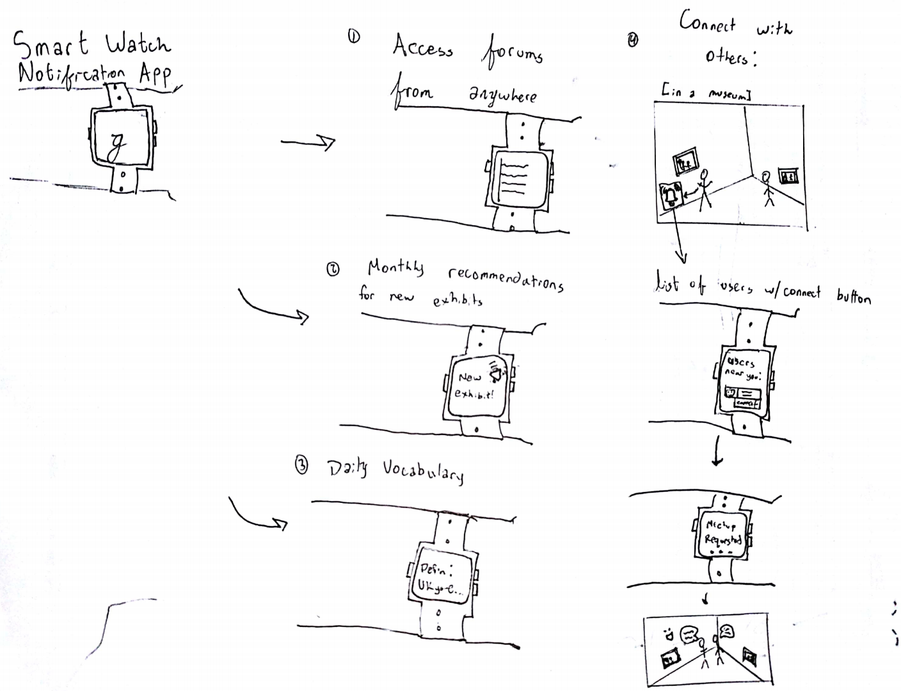

This design focuses on a webpage that the user would visit after their visit to the museum. In the webpage, the user will experience a series of screen that get more specific in the information they are looking at. From finding the museum they went to, to looking at the different exhibits, to looking at the pieces and sharing them, the user can navigate the museum in ways that take the pieces out to the world. While browsing museums, users can add pieces to a “sharing cart” where they can share all the selected pieces at once with some comments about each. Sharing can be done via Facebook, Twitter, a shareable link, or email.

Task 1: Sharing high quality photos of art on social media w/ commentary

When a user sees a piece of art they like, they do not have to worry about taking their phone out and take their time to take a picture. They can simply remember what it looks like and share it when they get home. The Gallery will have a high quality representation of each piece. A problem arises if the user forgets to visit The Gallery at home, so the possibility of sharing goes away.

Task 2: Bring discussion of art outside of the museum

When a user finds and shares pieces using this design, a snippet of the art’s description and author can be shared as well. This allows our character in this task to share the piece she found intriguing with colleagues in a way that preserves information about the piece.

Task 3: Make art/language accessible to casual museum goers

When expanding on different pieces of art, users have the option to leave comments for the world to see. This can allow Xavier to read other people’s thoughts and comments on the art as well as to ask other users of The Gallery what they thought about certain aspects of the piece.

Task 4: Sharing thoughts with family and friends

This design of The Gallery gives a shareable link for people to send in a more private context. This link can be sent to a family group chat so that Joseph does not have to worry about sharing the art with non-family members.

This design creates a smart watch app for The Gallery.  It helps complete a few key tasks. By allowing users to read their forums and updates on their watch, we successfully do the task of (1) bringing art out of the museum.  Next, with notifications we succeed in two tasks: (2) making the language around art more accessible (daily vocabulary), and (3) tailored recommendations based on preferences (monthly exhibit/installation alerts).  Our final task tackled is using the smart watch to (4) connect with others. We do this by giving alerts while users are in museums, which show what other users are in the area; one user taps to connect, the other confirms, and their museum locations are shared so they can meet up.

Descrition.
