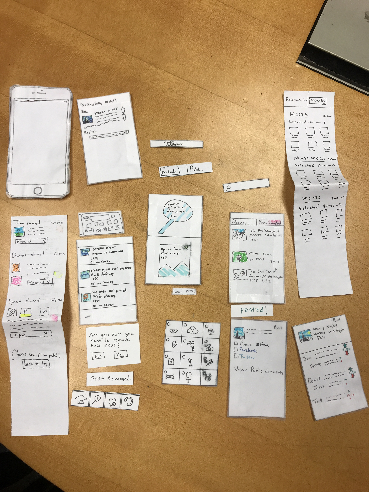

# Title

Step into The Gallery: Discover Art and let Art Discover you. 

# Team Members

Spencer Carillo - Designer

Daniel Woldegiorgis - Designer

Javier Esparza - Designer

# Problem and Solution Overview

Museum goers are usually very observant and are taken through a wave of emotions as they move from one piece to the next, but they seem to leave all these thoughts at the Museum door when they exit the exhibition. This can result as a combination of different factors: absence of a dedicated audience for their views, inaccessibility of good quality images for illustrative purposes, and sometimes its just inability to find pieces that appeal enough to them to make a felt experiential reaction. The Gallery aims to solve this problem by providing a platform for people to share their thoughts about Art and making sure they have interesting Art to talk about right at their fingertips by giving them timely and targeted recommendations to Museum exhibitions.  

# Initial Paper Prototype

The overview above shows all the pieces that were utilized in creating the initial paper prototype. The two main tasks that users are able to perform using the prototype are bringing discussion out of museums and getting recommendations. The prototype allows users to comment, and react to existing posts as well as generate new posts of their own. On top of this, the prototype also allows users to get recommendations based on location, preset artistic preferences and past viewing history. 

More information about our initial paper prototype including our two primary task walkthroughs can be found [here](https://ethioeph.github.io/muse-soc-network/assignments/paper_prototype/).

# Testing Process 

Our testing process involved an initial cognitive walkthrough, followed by two heuristic evaluations and three usability tests. Our initial cognitive walkthrough was performed right after we had finished creating the paper prototype and it helped us conceptualize the scope of the functionality as well as limitations that were present so we made minor edits such as creating options to upload pictures from personal gallery and enabling comments on posts. 

Following these edits, during the in class heuristic evaluations we noticed other issues which surfaced such as the absence of a back button and the ambiguity of the recommendation icon. Following this we performed our usability tests on three Williams Students. In all three of these usability tests,  we introduced the app as a work in progress so that our users were more likely to suggest edits when going through trying to perform the tasks that we had specified: Posting Starry Night to friends, Searching for nearby museum/exhibit recommendation, Scrolling through and checking their friend and public feeds. 

In our initial usability test, as we had anticipated from our earlier heuristic evaluation, the recommendation icon was a little vague and misleading, so instead of simply changing the icon ourselves, we created multiple versions of the icon and had our second usability test participant verbalize which one most resembled a recommendation icon for him. We then used this new recommendation for our third and final usability test and did not notice any problems with signifying that the button was for making recommendations. In additon to this, we also gave our users an opportunity to say anything that they changes they would make to make the experience better at the end of each usability test and included took their views into consideration in future design iterations for the paper prototypes.

More inforamtion about the [heuristic evaluation](https://ethioeph.github.io/muse-soc-network/assignments/heuristic_evaluations/), [first](https://ethioeph.github.io/muse-soc-network/assignments/usability_test_checkin/), [second](https://ethioeph.github.io/muse-soc-network/assignments/usability_testing_review/), and [third](https://ethioeph.github.io/muse-soc-network/assignments/usability_testing_review/) usability tests can be found by clicking on the links provided.

# Testing Results

Having performed the heuristic evaluations and three usability tests we were able to identify a host of design flaws that we had not anticipated while creating our initial paper prototype. For ease of consumption we have created a bulleted list of the problem we identified and the fix that was instrumented below.

- Issue 1: Ambiguity of the recommendation icon
    - Fix: Tested 5 different recommendation icons and selected the one which seemed to be more emblematic of recommendations as per the suggestion of a usability test participant.
- Issue 2: Absence of a Back Button
    - Fix: Having noticed the only way to back was to use the Home button, we decided to include a dedicated back button in the revised prototype.
- Issue 3: Insufficient feedback when certain tasks had been accomplished. For example, when a post had been finished, deleted, etc.
    - Fix: some of our usability test participants were not sure when they had fully completed a task because of lack of proper status updates. so we added more feedback to signify task completion. Examples include "Posted!" and "Deleted!"
- Issue 4: Friends or Public top navigation panel disappeared during scrolling
    - Fix: We fixed the Friends or Public top navigation panel to be visible even while scrolling
- Issue 5: Dual ambiguity of Upload and Search
    - Fix: We noticed that some of our users were undestandably having a hard time whether to click the upload or search button in order to make a post. So we decided to make the process more straightforward and merged the two functionalities into one.
- Issue 6: No warning before performing irrevocable task.
    - Fix: We made sure to add warning messages before actions that might be hard to reverse. One such example is the inclusion of a warning before deleting a post.
- Issue 7: No indicator if you’ve seen all posts
    - Fix: In order to notify people when scrolling is no longer an option we included a small textual notification of the end of your friends' post feed. 
 
We learned that at the end of the day, we are not our users and there are multiple ways that flaws can creep into what appears to be a fully functional prototype. We also learned that building navigation can be difficult because of the way that people interact with your prototype in ways that you had not anticipated. However, we now appreciate the value of doing usability test and are looking forward to making more improvements by conducting more usability tests perhaps using our digital mockup.

# Final Paper Prototype

Our final paper prototype aimed to fix several of the critical issues of our initial paper prototype.  These issues were identified both through our in class activities and through our usability tests.  The major edits which needed to be made were: simplifying our search and upload functions, clarifying our recommendation indicator, and generally improving represented capabilities (such as showing what comments would look like).  Most of these edits came in the form of improving our main navigation bar at the bottom of every screen, collapsing the search and upload buttons into one upload button, and updating the recommendation logo from our signature G to a fire icon.  The actual pathways for our main tasks did not change very much; and they are still uploading artwork and engaging in comment sections, and finding recommendations for pieces of art and local museums

# Digital Mockup

Our [digital mockup](https://projects.invisionapp.com/prototype/The-Gallery-cjoevq7zt00o9d301mqblp6m8) is extremely similar to our final paper prototype.  We included a few minor edits, however, and added a lot more functionality.  One edit was changing out flame recommendation logo into a plussed-heart recommendation logo, further simplifying our recommendation feature.  We also had to add a back button to our screens, allowing users the option to undo or reverse actions, go back to the previous screen, etc.  We also implemented a few more buttons, such as “Learn More” when looking at recommendation screens, which take users to detailed information available about pieces, as well as giving them direct access to user comments about those pieces.  We see that our primary task of increasing discussion outside of the museum is more fleshed out through the implementation of comments, and we focused a lot more on our recommendation portion by adding the “Learn More” features and cleaning up the general layout compared to our paper prototypes.

Present your digital mockup. Convey the critical aspects of your design, including your two primary tasks. Briefly discuss any changes you needed to make as you switched to your digital tools instead of paper. Briefly discuss any changes you made in response to critique. Include descriptions of how your design supports each of your primary tasks (e.g., one paragraph per task).

# Discussion

We notice that our tasks have no shifted over the course of this process.  I think that it would have been beneficial to have more time to select tasks, and to make the task-orientation presented less strictly so we could have more freedom in deviating from our initial selection of tasks.  The process of iterative design was tedious and time-consuming, but the benefits of it are clear.  When we look at our very first sketches, even before our paper prototype, versus our final paper prototype and digital mockups, we see that we made major improvements.  These include both small details, such as icon selection, as well as major aspects of our design, including layout and task pathways.  The usability tests were fun, but overall seemed a bit pointless.  We understand their usefulness of these tests in research and industry, but trying to complete these tasks as students, alongside other students, didn’t yield the most useful results.  These tests yielded small improvements to our design, such as better icon selection, but did not prove remarkably useful otherwise.  We believe that our design would have benefitted from more iterations, but the overall method of being made to perform these tests and tasks on random students should be reevaluated.  We do see that the process ultimately led to major improvements on our final design as outlined above, but most of these come from us, as the designers, spending so much time around our design for these tests, rather than from the actual test results themselves. 

# Appendix

Include links to all materials involved in your testing. Includes any instructions or task descriptions you handed out or read aloud to your participants. Include identified critical incidents from your usability testing. The appendix materials and screenshots do not count in your page limit.
