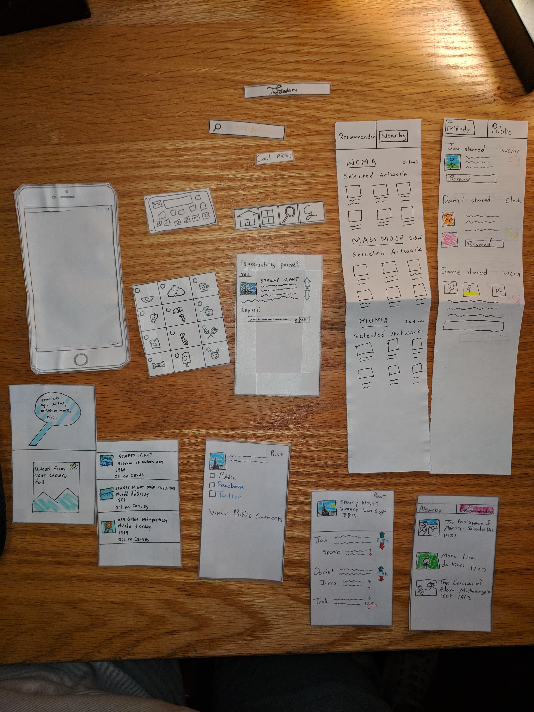

# Title

Step into The Gallery: Discover Art and let Art Discover you. 

# Team Members

Spencer Carillo - Designer

Daniel Woldegiorgis - Designer

Javier Esparza - Designer

# Problem and Solution Overview

Museum goers are usually very observant and are taken through a wave of emotions as they move from one piece to the next, but they seem to leave all these thoughts at the Museum door when they exit the exhibition. This can result as a combination of different factors: absence of a dedicated audience for their views, inaccessibility of good quality images for illustrative purposes, and sometimes its just inability to find pieces that appeal enough to them enough to make a felt experiential reaction. The Gallery aims to solve this problem by providing a platform for people to share their thoughts about Art and making sure they have interesting Art to talk about right at their fingertips by giving them timely and targeted recommendations to Museum exhibitions.  

# Initial Paper Prototype

The overview above shows all the pieces that were utilized in creating the initial paper prototype. The two main tasks that users are able to perform using the prototype are bringing discussion out of museums and getting recommendations. The prototype allows users to comment, and react to existing posts as well as generate new posts of their own. On top of this, the prototype also allows users to get recommendations based on location, preset artistic preferences and past viewing history. 

More information about our initial paper prototype including our two primary task walkthroughs can be found [here](https://ethioeph.github.io/muse-soc-network/assignments/paper_prototype/).

# Testing Process 

Our testing process involved an initial cognitive walkthrough, followed by two heuristic evaluations and three usability tests. Our initial cognitive walkthrough was performed right after we had finished creating the paper prototype and it helped us conceptualize the scope of the functionality as well as limitations that were present so we made minor edits such as creating options to upload pictures from personal gallery and enabling comments on posts. 

Following these edits, during the in class heuristic evaluations we noticed other issues which surfaced such as the absence of a back button and the ambiguity of the recommendation icon. Following this we performed our usability tests on three Williams Students. In all three of these usability tests,  we introduced the app as a work in progress so that our users were more likely to suggest edits when going through trying to perform the tasks that we had specified: Posting Starry Night to friends, Searching for nearby museum/exhibit recommendation, Scrolling through and checking their friend and public feeds. 

In our initial usability test, as we had anticipated from our earlier heuristic evaluation, the recommendation icon was a little vague and misleading, so instead of simply changing the icon ourselves, we created multiple versions of the icon and had our second usability test participant verbalize which one most resembled a recommendation icon for him. We then used this new recommendation for our third and final usability test and did not notice any problems with signifying that the button was for making recommendations. In additon to this, we also gave our users an opportunity to say anything that they changes they would make to make the experience better at the end of each usability test and included took their views into consideration in future design iterations for the paper prototypes.

More inforamtion about the [heuristic evaluation](https://ethioeph.github.io/muse-soc-network/assignments/heuristic_evaluations/), [first](https://ethioeph.github.io/muse-soc-network/assignments/usability_test_checkin/), [second](https://ethioeph.github.io/muse-soc-network/assignments/usability_testing_review/), and [third](https://ethioeph.github.io/muse-soc-network/assignments/usability_testing_review/) usability tests can be found by clicking on the links provided.

# Testing Results

Summarize the results of your paper prototype testing and refinement. Present what you learned about each version of your prototype and what changes you made as a result. This will include changes from your heuristic evaluation, usability testing, and design critique.

# Final Paper Prototype

Present your final version of your paper prototype, as you did for your initial paper prototype above. Convey the critical aspects of your design, including your two primary tasks.

# Digital Mockup

Present your digital mockup. Convey the critical aspects of your design, including your two primary tasks. Briefly discuss any changes you needed to make as you switched to your digital tools instead of paper. Briefly discuss any changes you made in response to critique. Include descriptions of how your design supports each of your primary tasks (e.g., one paragraph per task).

# Discussion

This is new content to generate! Reflect upon and discuss your project and your results. For example:
What did you learn from the process of iterative design?
How did the process shape your final design?
How have your tasks changed as a result of your usability tests?
Do you think you could have used more, or fewer, iterations upon your design?

# Appendix

Include links to all materials involved in your testing. Includes any instructions or task descriptions you handed out or read aloud to your participants. Include identified critical incidents from your usability testing. The appendix materials and screenshots do not count in your page limit.
