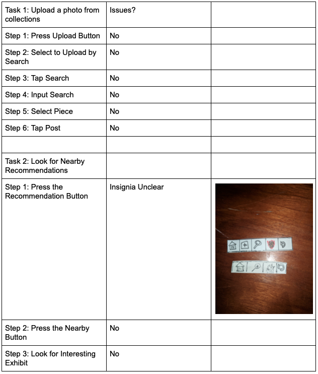
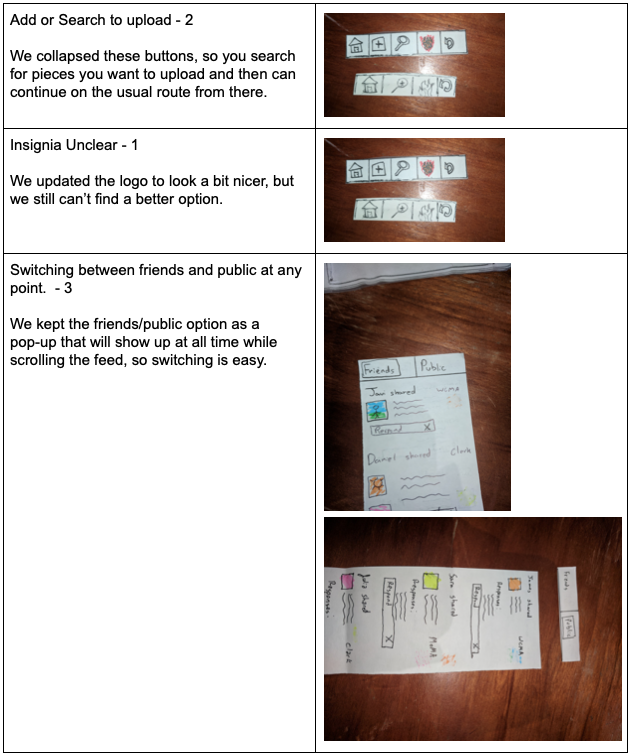
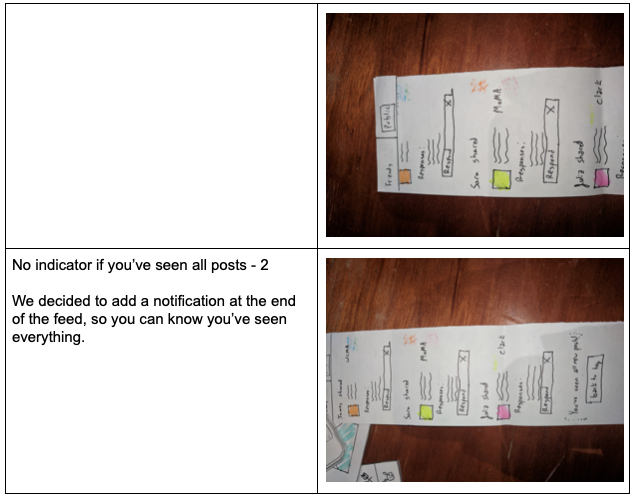
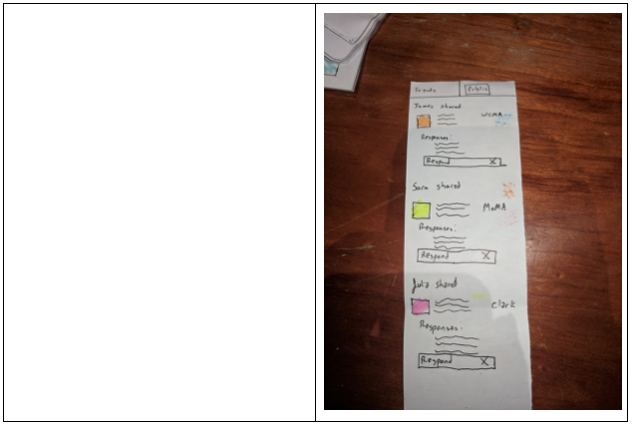

Our participant was a Williams College senior.  We’ll call her Shruti for the sake of anonymity.  We did our first usability test in a room in upstairs Paresky (Paresky 207).  We chose this participant because she was unfamiliar with this prototype, technology, etc.  She is able more readily to compare our design with her preconceived notions of how social media functions in the status quo, with her own experiences using apps like Facebook and Instagram.  She is someone who didn’t know any of us coming into the test, and didn’t know what our class was really about, so we had the chance to work from that.  We chose this location because it was relatively isolated and allowed Shruti to focus, but it was still closer to simulating a real environment, with ambient noise and made for a more realistic practise environment without being distracting.  We introduced our test as follows:
“Hello, today we’re going to be doing a usability test for our platform called The Gallery.  This basically means we have this paper version of our design here, and we would like you to go through and use the app as though it were on your phone, while 
Daniel will act as the “computer,” and move the screens based on what you press.  Our intention is to figure out different strengths and weaknesses of our design.  Our app itself is aimed at giving people ways to share their thoughts about artwork they see in museums, as well as to find new museums and works of art to visit.  We have three tasks for you to accomplish today: (1) post Starry Night to your friends, (2) search for nearby recommendation, and (3) scroll through both your friend and public feeds.

Explainer: Spence
Computer: Daniel
Notetaker: Javi

Overall, our biggest realisation was that we could have done this in a more isolated location.  The noise and environment never actually became an issue, but I think it would have been easier and quicker to simply got to a room and complete this exercise.  Beyond that, I think we were comfortable with the way we introduced the assignment and our participant selection, but we’re always open to feedback to improve those things.

The only issue we identified in our cognitive walkthrough was that our recommendation insignia is still ambiguous.  We ultimately decided that this issue is slightly problematic, but it’s hard to come up with a better or more usable insignia.  We ran into this issue again in our usability test, so we decided to fix it during that portion, as you’ll see later.

Critical Incidents
* Post
  - Add or Search?
* Recommendation
  - It went well
  - Recommendation insignia is still U N C L E A R
* Scrolling feed, friends and public
  - No easy switch between friends and public when you’ve scrolled far down
  - No indicator that you’ve seen all of the new posts

Moving forward, our plan is to conduct two more usability tests on Williams students.  We aim to identify further issues with our design.  We will rotate through our positions, letting each of us try each role once.  I don’t anticipate using any new approaches, but we’d like to do our tests in quieter, more isolated locations.

