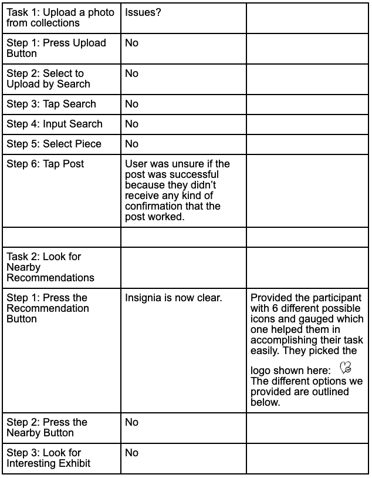
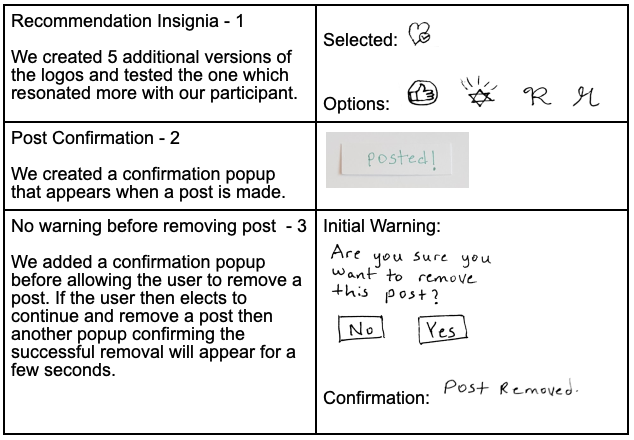
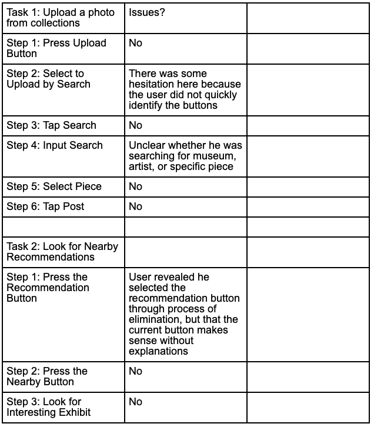
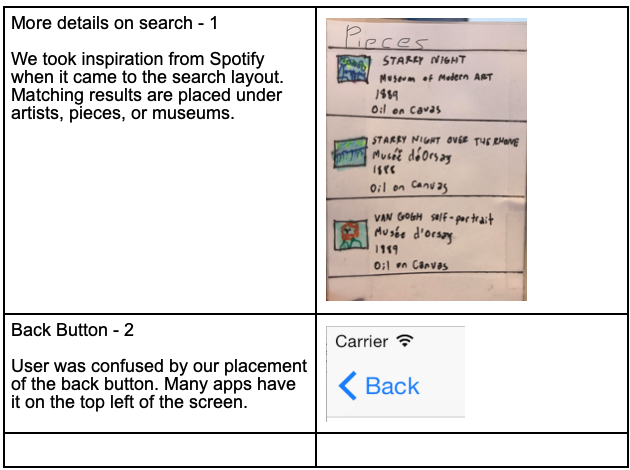

# First Usability Test

The observations and results of our first Usability test can be found [here](https://ethioeph.github.io/muse-soc-network/assignments/usability_test_checkin/)

# Second Usability Test

Our second usability test was also with another Williams College student inside of our schow study room. Having noticed the effect of background noise in disrupting the focus of our participant in our first usability test we decided to conduct the second usability test in one of the small study rooms in schow where we could both hear our participant’s train of thought in navigating our prototype and catching the times when our participant failed to notice some of the signifiers within the prototype that could have helped them in performing the three tasks that we had set for them. 

We introduced the three tasks: posting starry night to friends, searching for nearby recommendation and scrolling through friend and public feeds, the same way that we introduced our first usability test to standardize the results we obtain when comparing the results we obtain after the modifications we have made to the results obtained using our initial prototype. 

Critical Incidents
- Recommendation icon issue(planned to be addressed during the usability test)
  - Picking a good recommendation icon from among 6 alternatives
- Post
  - No confirmation that post has been completed
  - No warning when deleting a post.

Explainer: Javi
Computer: Spence
Notetaker: Daniel

In order to address the ambiguity of our recommendation icon from our first usability test we tried to create a host of different possible recommendation icons and asked our second usability test participant which ones they found appealing both during and at the end of our usability test. 

# Third Usability Test

We conducted our third usability test on a computer science major who is not enrolled in our class. This test took place in Lee’s in order to keep testing interaction in a realistic environment for the user. This test followed the format of the first. We told the participant the context of our test, how it will be used to improve our design. We also highlighted our individual roles in the test, the purpose of the app, and the tasks to be accomplished. For this test, we were strict on letting the user be immersed in the paper prototype. We did not talk to him when he was stuck and only communicated the next task to do.

Critical Incidents
Search
No indication whether he was searching for a piece, artist, or museum.

Explainer: Daniel
Computer: Javi	
Notetaker: Spence

# Prototype Overview And Task Walkthrough

The paper prototype walkthrough of the tasks we had our users perform can be found [here](https://ethioeph.github.io/muse-soc-network/assignments/paper_prototype/) [comment]: <> (Modify this to task_walkthrough.md after editing that file.)

# Discussion

The three usability tests that we conducted were with Williams Students. We decided to pick people who are all students in college because we wanted to maintain be able to compare the effects of our design changes by standardizing and minimizing the possible factors that could contribute to different. Our first usability test hinted was not quite enough for our participant to be able to think out loud while maintaining their train of thought. So we decided to conduct on of our usability tests in a more quiet space to get better data. However, for our last usability test we decided to make the scenario resemble a real world interaction with our product so we tried to pick a setting that would most resemble the environment in which we expect The Gallery would be used. 

Through the process of doing our initial cognitive walkthrough and the three ensuing usability tests we were able to identify some of the shortcomings of our paper prototype and modify them. One such salient modification was the inclusion of a back button. The only way to navigate back was to use the home button and this became apparent to us during our initial cognitive walkthrough since we had to redo every command up to the point we wanted to return to. 

Another revision that we made was the change to our recommendation logo. After two consecutive revisions, our participants were still unable to discern the recommendation logo when trying to perform our second task (i.e. checking the recommendation supplied by The Gallery). Therefore, we created a host of different logos and had our users decide which ones most resembles a recommendation icon and selected modified the navigation bar as such.

One other revision that we made was the addition of warning before deleting a post. In a previous version, accidentally pressing delete would have resulted in immediate and permanent removal of a post. However, with this modification we are able to make sure that all deleted posts are done with intention. 
